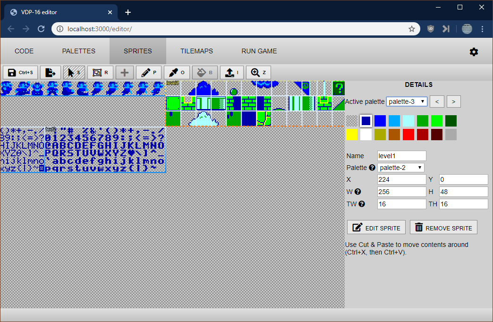

# Getting started

* Make sure that you have git (look up git for Windows).
* Also install node.js (on Windows you can install it through [scoop](https://scoop.sh/), you can follow [this guide](https://spin.atomicobject.com/2018/06/18/windows-node-js/)).
* Clone this repository:

`git clone https://github.com/Brunni132/vdp16-sample-game.git`

* Then move into it and install modules.

```
cd vdp16-sample-game
npm install
```

* Then run the editor:

`npm run editor-open`

* A browser window should open, allowing you to write the code (you can always edit the file `src/game-main.js` directly with an editor such as [Visual Studio Code (recommended)](https://code.visualstudio.com/)).



* Samples, with link to the documentation: https://brunni132.github.io/vdp16-samples/
* Video showing how to do a Hello World and more: https://www.youtube.com/watch?v=RVC4UjutBoU

# Creating a standalone executable

* By default resources are compiled on the fly (webpack and sass via the middleware). You can also build an executable and use it by running `node server/server-main-standalone.js`.
* You can create an executable (currently configured for Windows-x86 to take less space) by running `npm run editor-build-exe-win32`.
* The executable needs to copied along with the following, respecting the folder structure:
	* main.js
	* index.html
	* dist/*
	* src/*
	* lib/*
* You can then run vdp16-contained.exe from the resulting directory.


